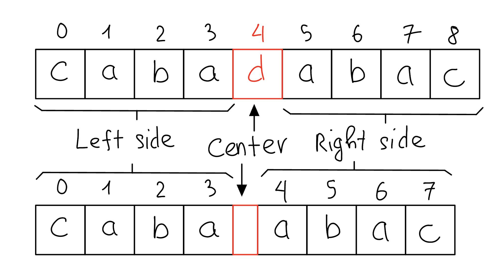
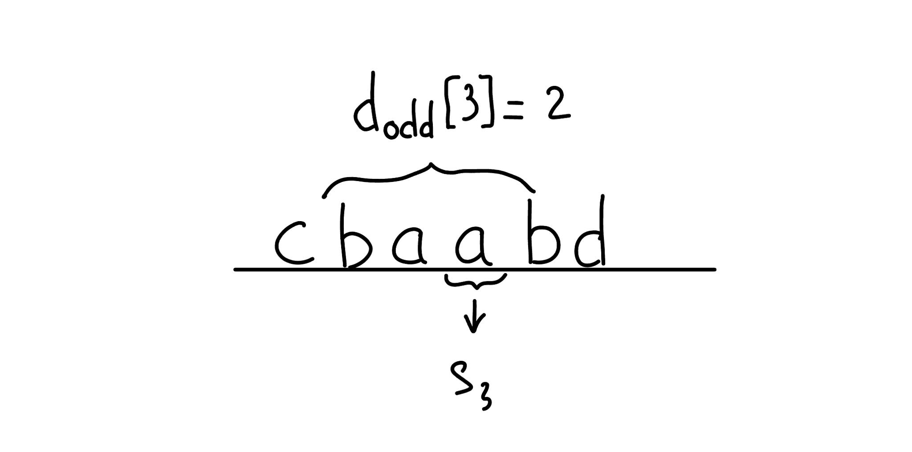

Mình mới gặp và tìm hiểu thuật toán này 🐳, khi đang làm 1 bài trên [leetcode](https://leetcode.com/problems/palindromic-substrings/description/) 😃

# Thế nào là 1 Palindrome ?

Mình hiểu `palindrome` là 1 chuỗi ký tự đối xứng. Ví dụ:



Chuỗi "cabadabac" là 1 `palindrome`. Vì chuỗi này đối xứng qua ký tự 'd' ở vị trí 4 (tính từ 0, theo cách index trong javascript). Hay chuỗi "acbaabca" cũng là 1 `palindrome`, chuỗi này đối xứng qua vị trí giữa 2 ký tự 'a'.

Để dễ hình dung hơn, các bạn có thể tưởng tưởng 1 `palindrome` được tạo ra bằng cách phản chiếu 1 chuỗi ký tự qua "gương".

Vậy `sub-palindromes` (còn gọi là `palindrome substrings`) là các chuỗi con của một chuỗi ban đầu và là `palindrome`.

Theo mình tìm hiểu thì `sub-palindromes` là một khái niệm quan trọng trong xử lý chuỗi và có ứng dụng trong nhiều bài toán, bao gồm tìm kiếm từ, mã hóa, nén dữ liệu và xử lý ngôn ngữ tự nhiên. Trong bài viết này mình sẽ nói đến 1 bài toán khá hay. Go go 🐳

# Bài toán: Tìm tất cả các sub-palindromes trong thời gian $O(n)$

## Bài toán

> Cho chuỗi  $s$  với độ dài  $n$ . Tìm tất cả các cặp  $(i, j)$  sao cho chuỗi con  $s[i\dots j]$  là một chuỗi đối xứng. Chuỗi  $t$  là một chuỗi đối xứng khi  $t = t_{rev}$  ( $t_{rev}$  là một chuỗi đảo ngược của  $t$ ).

## Phân tích

- Chuỗi đối xứng ở đây chính là `palindrome` mình đã đề cập ở trên.

- Trong trường hợp xấu nhất, chuỗi ban đầu có thể có tới  $O(n^2)$  chuỗi con đối xứng. Lúc đầu mình nhìn qua thì nghĩ là không có thuật toán tuyến tính nào cho bài toán này. Tức là sẽ không có bài viết này 👀

- Phân tích kỹ hơn 🔎: Các palindrome sẽ có độ dài lẻ và chẵn khác nhau, và được tính riêng là  $d_{odd}[i]$  và  $d_{even}[i]$ . Đối với các palindrome có độ dài chẵn, chúng ta giả định rằng chúng có tâm ở vị trí  $i$  nếu hai ký tự trung tâm của chúng là  $s[i]$  và  $s[i-1]$ .

  Ví dụ, chuỗi  $s = abababc$  có 3 palindromes có độ dài lẻ với tâm ở vị trí  $s[3] = b$ , tức là $d_{odd}[3] = 3$ :

    <!--  -->
    <math xmlns="http://www.w3.org/1998/Math/MathML" display="block">
    <mi>a</mi>
    <mtext>&#xA0;</mtext>
    <mover>
      <mrow data-mjx-texclass="OP">
        <mover>
          <mrow>
            <mi>b</mi>
            <mtext>&#xA0;</mtext>
            <mi>a</mi>
            <mtext>&#xA0;</mtext>
            <munder>
              <mrow data-mjx-texclass="OP">
                <munder>
                  <mi>b</mi>
                  <mo>&#x23DF;</mo>
                </munder>
              </mrow>
              <mrow data-mjx-texclass="ORD">
                <msub>
                  <mi>s</mi>
                  <mn>3</mn>
                </msub>
              </mrow>
            </munder>
            <mtext>&#xA0;</mtext>
            <mi>a</mi>
            <mtext>&#xA0;</mtext>
            <mi>b</mi>
          </mrow>
          <mo>&#x23DE;</mo>
        </mover>
      </mrow>
      <mrow data-mjx-texclass="ORD">
        <msub>
          <mi>d</mi>
          <mrow data-mjx-texclass="ORD">
            <mi>o</mi>
            <mi>d</mi>
            <mi>d</mi>
          </mrow>
        </msub>
        <mo stretchy="false">[</mo>
        <mn>3</mn>
        <mo stretchy="false">]</mo>
        <mo>=</mo>
        <mn>3</mn>
      </mrow>
    </mover>
    <mi>c</mi>
  </math>

  Và chuỗi  $s = cbaabd$  có 2 palindromes có độ dài bằng nhau với tâm ở vị trí  $s[3] = a$ , tức là $d_{even}[3] = 2$ :

    <!--  -->
    <math xmlns="http://www.w3.org/1998/Math/MathML" display="block">
    <mi>c</mi>
    <mtext>&#xA0;</mtext>
    <mover>
      <mrow data-mjx-texclass="OP">
        <mover>
          <mrow>
            <mi>b</mi>
            <mtext>&#xA0;</mtext>
            <mi>a</mi>
            <mtext>&#xA0;</mtext>
            <munder>
              <mrow data-mjx-texclass="OP">
                <munder>
                  <mi>a</mi>
                  <mo>&#x23DF;</mo>
                </munder>
              </mrow>
              <mrow data-mjx-texclass="ORD">
                <msub>
                  <mi>s</mi>
                  <mn>3</mn>
                </msub>
              </mrow>
            </munder>
            <mtext>&#xA0;</mtext>
            <mi>b</mi>
          </mrow>
          <mo>&#x23DE;</mo>
        </mover>
      </mrow>
      <mrow data-mjx-texclass="ORD">
        <msub>
          <mi>d</mi>
          <mrow data-mjx-texclass="ORD">
            <mi>e</mi>
            <mi>v</mi>
            <mi>e</mi>
            <mi>n</mi>
          </mrow>
        </msub>
        <mo stretchy="false">[</mo>
        <mn>3</mn>
        <mo stretchy="false">]</mo>
        <mo>=</mo>
        <mn>2</mn>
      </mrow>
    </mover>
    <mi>d</mi>
  </math>

Thực tế, vấn đề này đã có nhiều giải pháp: với String Hashing, nó có thể được giải quyết trong  $O(n\cdot \log n)$ , và với Suffix Trees và Fast LCA , vấn đề này có thể được giải quyết trong $O(n)$ . Các bạn có thể tự tìm hiểu.

Nhưng thuật toán mình nói trong đến trong bài này đơn giản hơn và có ít hằng số ẩn hơn về độ phức tạp của bộ nhớ và thời gian. Thuật toán này được phát hiện bởi **Glenn K. Manacher** vào năm 1975.

Về **ý tưởng** cốt lõi là tính toán số lượng palindrome hiện tại dựa trên thông tin palindrome được tính toán trước đó. Nghe giống DP nhỉ 👀

# Code thôi 💻

## Động não 🤔

Để xử lý vấn đề palindrome có độ dài lẻ và chẵn khác nhau, thay vì tính toán cho cả 2 trường hợp. Chúng ta sẽ biến đổi chuỗi ban đầu 1 chút. Cụ thể, mình sẽ thêm ký tự `#` vào đầu, cuối và giữa các ký tự của chuỗi ban đầu. Trông nó sẽ như vậy:


Sau khi modify chuỗi, chúng ta sẽ luôn thu được 1 chuỗi mới có độ dài lẻ. Và sẽ không có trường hợp palindrome có độ dài chẵn tạo bởi các ký tự trong chuỗi ban đầu.

Bởi vì giữa chúng luôn có ký tự **'#'**. Do đó chúng ta đã bỏ qua được vấn đề phải tính toán số lượng các palindromes có độ dài chẵn.

Vậy giờ mình chỉ cần tìm số lượng các palindrome lẻ và lưu lại. 👀 Nghe dễ nhỉ

## Thuật toán "ngây thơ"

1. Khởi tạo một biến đếm tên `res` để theo dõi số lượng xâu đối xứng.
2. Tạo một chuỗi bắt đầu bằng '^' và kết thúc bằng '$' là `newS` được tạo bằng cách chèn ký tự `#` giữa mỗi ký tự của chuỗi đầu vào s.
3. Tạo mảng `p[]` đại diện cho $d_{odd}[]$
4. Lặp lại từng chỉ số $i$ của chuỗi được sửa đổi `newS`.
5. Đối với mỗi chỉ số $i$, khởi tạo các biến `l` và `r` bằng 1, và `p[i]` bằng 0.
6. Thực hiện vòng lặp while khi các ký tự tại các chỉ số $i - l$ và $i + r$ hợp lệ và bằng nhau. Vòng lặp này mở rộng xâu đối xứng được tập trung tại chỉ số i và đếm số lượng xâu đối xứng.
7. Bên trong vòng lặp, tăng `p[i]` lên 1 và cập nhật `l` và `r` bằng cách tăng chúng lên 1.
8. Sau khi vòng lặp while kết thúc, thêm `Math.ceil(p[i] / 2)` vào `res`. Điều này là vì mỗi chuỗi đối xứng hợp lệ được tính hai lần (một lần cho độ dài lẻ và một lần cho độ dài chẵn), vì vậy chúng ta chia `p[i]` cho 2 và lấy giá trị làm tròn của nó.
9. Lặp lại các bước 4-7 cho tất cả các chỉ số $i$ của chuỗi được sửa đổi `newS`.
10. Cuối cùng, trả về giá trị của `res`, đại diện cho tổng số lượng xâu đối xứng trong chuỗi ban đầu s.

Mình dùng **Javascript** để code bài này:

```javascript
var SubPalindromes = function (s) {
  let res = 0;
  let newS = "^#";
  for (let i = 0; i < s.length; i++) {
    newS += s[i] + "#";
  }
  newS += "$";
  let n = newS.length,
    l,
    r,
    count;
  let p = new Array(n).fill(0);
  for (let i = 1; i < n - 1; i++) {
    p[i] = 0;
    l = 1;
    r = 1;
    while (i - l >= 0 && i + r < n && newS[i - l] == newS[i + r]) {
      p[i]++;
      l++;
      r++;
    }
    res += Math.ceil(p[i] / 2);
  }
  return res;
};
```

### Độ phức tạp

- **Thời gian**: $O(n^2)$, trong đó n là độ dài của chuỗi đầu vào s. Thuật toán lặp qua từng ký tự của chuỗi đã sửa đổi được xử lý và đối với mỗi ký tự, nó mở rộng bảng màu ở cả hai bên. Trong trường hợp xấu nhất, mỗi ký tự của `newS` có thể là trung tâm của một palindrome, dẫn đến các lần lặp O(n^2).
- **Không gian**: $O(n)$, trong đó n là độ dài của chuỗi đầu vào s. Chuỗi đã sửa đổi processS yêu cầu thêm dung lượng O(n) để lưu trữ phiên bản đã sửa đổi.

## Thuật toán Manacher's 🐳

Với thuật tóa này, mình sẽ duy trì cặp biên $(l, r)$ của palindrome dài nhất hiện tại (tức sub-palindromes của s dài nhất bắt đầu từ $s[l+1]$ và kết thúc tại $s[r-1]$). Ban đầu, ta thiết lập $l = 0, r = 1$ , tương ứng với chuỗi rỗng. (Để gọn thì mình sẽ gọi "palindrome dài nhất hiện tại" là **maxPalindrome**)

Bây giờ, chúng ta cần tính toán $d_{odd}[i]$, trong đó tất cả các giá trị trước đó trong $d_{odd}[]$ đã được tính toán. Thuật toán trông như sau:

- Nếu $i$ không thuộc maxPalindrome, tức là $i \geq r$, chúng ta sẽ thực hiện tương tự [thuật toán "Ngây thơ"](#thuật-toán-ngây-thơ) ở trên.

  Cụ thể, chúng ta sẽ tăng lần lượt $d_{odd}[i]$ và mỗi lần sẽ kiểm tra xem chuỗi con $[i - d_{odd}[i]\dots i + d_{odd}[i]]$ có phải là một palindrome hay không. Nếu không hoặc vượt quá chuỗi $s$, chúng ta sẽ dừng lại. Sau khi kết thúc, mình tính đươc $d_{odd}[i]$ và lưu lại. Cuối cùng, mình sẽ cập nhật maxPalindrome $(l, r)$. Bước này khá đơn giản, nên tự làm nhé 👀

- Bây giờ, xét trường hợp khi $i \lt r$. Mình sẽ tìm vị trí "đối xứng" của $i$ trong maxPalindrome $(l, r)$, tức là sẽ lấy vị trí $j = l + (r - i)$ và lấy giá trị của $d_{odd}[j]$. Vì $j$ là vị trí đối xứng với $i$ qua tâm $(l+r)/2$, mình có thể gán $d_{odd}[i] = d_{odd}[j]$. Giải thích cho điều này (palindrome tâm $j$ thực sự được "sao chép" vào palindrome tâm $i$):

  <math xmlns="http://www.w3.org/1998/Math/MathML" display="block">
    <mo>&#x2026;</mo>
    <mtext>&#xA0;</mtext>
    <mover>
      <mrow data-mjx-texclass="OP">
        <mover>
          <mrow>
            <msub>
              <mi>s</mi>
              <mrow data-mjx-texclass="ORD">
                <mi>l</mi>
                <mo>+</mo>
                <mn>1</mn>
              </mrow>
            </msub>
            <mtext>&#xA0;</mtext>
            <mo>&#x2026;</mo>
            <mtext>&#xA0;</mtext>
            <munder>
              <mrow data-mjx-texclass="OP">
                <munder>
                  <mrow>
                    <msub>
                      <mi>s</mi>
                      <mrow data-mjx-texclass="ORD">
                        <mi>j</mi>
                        <mo>&#x2212;</mo>
                        <msub>
                          <mi>d</mi>
                          <mrow data-mjx-texclass="ORD">
                            <mi>o</mi>
                            <mi>d</mi>
                            <mi>d</mi>
                          </mrow>
                        </msub>
                        <mo stretchy="false">[</mo>
                        <mi>j</mi>
                        <mo stretchy="false">]</mo>
                        <mo>+</mo>
                        <mn>1</mn>
                      </mrow>
                    </msub>
                    <mtext>&#xA0;</mtext>
                    <mo>&#x2026;</mo>
                    <mtext>&#xA0;</mtext>
                    <msub>
                      <mi>s</mi>
                      <mi>j</mi>
                    </msub>
                    <mtext>&#xA0;</mtext>
                    <mo>&#x2026;</mo>
                    <mtext>&#xA0;</mtext>
                    <msub>
                      <mi>s</mi>
                      <mrow data-mjx-texclass="ORD">
                        <mi>j</mi>
                        <mo>+</mo>
                        <msub>
                          <mi>d</mi>
                          <mrow data-mjx-texclass="ORD">
                            <mi>o</mi>
                            <mi>d</mi>
                            <mi>d</mi>
                          </mrow>
                        </msub>
                        <mo stretchy="false">[</mo>
                        <mi>j</mi>
                        <mo stretchy="false">]</mo>
                        <mo>&#x2212;</mo>
                        <mn>1</mn>
                      </mrow>
                    </msub>
                    <mtext>&#xA0;</mtext>
                  </mrow>
                  <mo>&#x23DF;</mo>
                </munder>
              </mrow>
              <mtext>palindrome tâm j</mtext>
            </munder>
            <mtext>&#xA0;</mtext>
            <mo>&#x2026;</mo>
            <mtext>&#xA0;</mtext>
            <munder>
              <mrow data-mjx-texclass="OP">
                <munder>
                  <mrow>
                    <msub>
                      <mi>s</mi>
                      <mrow data-mjx-texclass="ORD">
                        <mi>i</mi>
                        <mo>&#x2212;</mo>
                        <msub>
                          <mi>d</mi>
                          <mrow data-mjx-texclass="ORD">
                            <mi>o</mi>
                            <mi>d</mi>
                            <mi>d</mi>
                          </mrow>
                        </msub>
                        <mo stretchy="false">[</mo>
                        <mi>j</mi>
                        <mo stretchy="false">]</mo>
                        <mo>+</mo>
                        <mn>1</mn>
                      </mrow>
                    </msub>
                    <mtext>&#xA0;</mtext>
                    <mo>&#x2026;</mo>
                    <mtext>&#xA0;</mtext>
                    <msub>
                      <mi>s</mi>
                      <mi>i</mi>
                    </msub>
                    <mtext>&#xA0;</mtext>
                    <mo>&#x2026;</mo>
                    <mtext>&#xA0;</mtext>
                    <msub>
                      <mi>s</mi>
                      <mrow data-mjx-texclass="ORD">
                        <mi>i</mi>
                        <mo>+</mo>
                        <msub>
                          <mi>d</mi>
                          <mrow data-mjx-texclass="ORD">
                            <mi>o</mi>
                            <mi>d</mi>
                            <mi>d</mi>
                          </mrow>
                        </msub>
                        <mo stretchy="false">[</mo>
                        <mi>j</mi>
                        <mo stretchy="false">]</mo>
                        <mo>&#x2212;</mo>
                        <mn>1</mn>
                      </mrow>
                    </msub>
                    <mtext>&#xA0;</mtext>
                  </mrow>
                  <mo>&#x23DF;</mo>
                </munder>
              </mrow>
              <mtext>palindrome tâm i</mtext>
            </munder>
            <mtext>&#xA0;</mtext>
            <mo>&#x2026;</mo>
            <mtext>&#xA0;</mtext>
            <msub>
              <mi>s</mi>
              <mrow data-mjx-texclass="ORD">
                <mi>r</mi>
                <mo>&#x2212;</mo>
                <mn>1</mn>
              </mrow>
            </msub>
            <mtext>&#xA0;</mtext>
          </mrow>
          <mo>&#x23DE;</mo>
        </mover>
      </mrow>
      <mtext>maxPalindrome</mtext>
    </mover>
    <mtext>&#xA0;</mtext>
    <mo>&#x2026;</mo>
  </math>

  Cách này đã giảm đi khá nhiều độ phức tạp, thay vì mình phải tính $d_{odd}[i]$, mình sẽ dùng lại $d_{odd}[j]$ đã tính trước đó thông qua tính chất đối xứng, đơn giản ha 🐧

  Nhưng có một trường hợp đặc biệt: khi palindrome đang xét thuộc maxPalindrome nhưng vượt quá biên của nó, tức là $j - d_{odd}[j] \le l$  (hoặc  $i + d_{odd}[j] \ge r$ ). Mình sẽ không chắc chắn được lúc này $d_{odd}[i]$ có bằng $d_{odd}[j]$ hay không ? Vì đã vượt ra ngoài maxPalindrome, mà chúng ta chỉ kiếm soát được sự đối xứng bên trong maxPalindrome thôi 🐧.

  Để xử lý thì lúc đó mình sẽ đặt $d_{odd}[i] = r - i$. Sau đó, sẽ chạy thuật toán "Ngây thơ" để cố gắng tăng  $d_{odd}[i]$. Cách này vẫn sẽ giúp chúng ta giảm bớt được 1 khoảng nào đó khi tính toán  $d_{odd}[i]$ so với việc "Ngây thơ" từ đầu. 👀

  Cuối cùng vẫn không quên cập nhật maxPalindrome $(l, r)$

Sau khi kết thúc quá trình tính toán, việc còn lại đơn giản là trả về tổng của  $d_{odd}[]$ để có được tổng sub-palindromes.

Mình code bằng **Javascript**, vì trong bài này, vai trò của $l$ và $r$ giống nhau (vì tính đối xứng) và mình không dùng tới $l$ nên không đưa vào cho đơn giản 🐳

```javascript
let SubPalindromes = function (s) {
  let n = s.length;
  let newS = "^#";
  for (let i = 0; i < n; i++) {
    newS += s[i] + "#";
  }
  newS += "$";
  let p = new Array(newS.length).fill(0);
  let center = 0,
    r = 0;
  for (let i = 1; i < newS.length - 1; i++) {
    let mirror = 2 * center - i;
    if (i < r) {
      p[i] = Math.min(r - i, p[mirror]);
    }
    while (newS[i + p[i] + 1] == newS[i - p[i] - 1]) {
      p[i]++;
    }
    if (i + p[i] > r) {
      center = i;
      r = i + p[i];
    }
  }
  let result = p.reduce((a, b) => a + Math.floor((b + 1) / 2));
  return result;
};
```

### Độ phức tạp

Thoạt nhìn, không rõ ràng là thuật toán này có độ phức tạp thời gian tuyến tính, bởi vì mình đã chạy [thuật toán "Ngây thơ"](#thuật-toán-ngây-thơ) trong khi chạy thuật toán Manacher'.

Tuy nhiên, các bạn có thể thấy rằng mỗi lần lặp lại thuật toán "Ngây thơ" đều tăng $r$  ít nhất là 1 đơn vị. Và  $r$  không thể giảm trong thuật toán. Vì vậy, thuật toán "Ngây thơ" sẽ tăng $r$ n lần hay tổng số lần lặp là $O(n)$ .

Các phần khác của thuật toán Manacher's hoạt động rõ ràng trong thời gian tuyến tính. Như vậy, mình nhận được  độ phức tạp về thời gian là $O(n)$.
